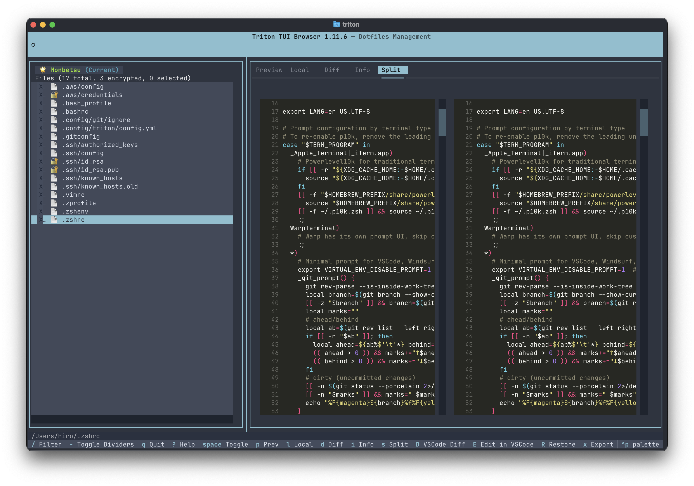

🇬🇧 English | 🇯🇵 [日本語](README_ja.md)

# Triton Dotfiles

> Secure multi-machine dotfiles management with encryption and AI-friendly configuration

[](https://github.com/asatamax/triton-dotfiles/releases)
[](https://www.python.org/)
[](LICENSE)



## Why Triton?

Managing dotfiles across multiple machines is painful:
- Copying files manually is error-prone
- Sensitive files (SSH keys, credentials) need encryption
- Tracking what changed between machines is tedious

Triton solves this by providing:
- **Centralized storage** in a private Git repository
- **Selective encryption** for sensitive files (AES-256-GCM)
- **Visual diff** between any two machines
- **One-command sync** with automatic backup of existing files

## Features

- **Multi-machine sync** - Each machine gets its own folder in the repository
- **Selective encryption** - SSH keys and credentials are encrypted; configs stay readable
- **Interactive TUI** - Browse, compare, and restore files visually
- **AI-friendly CLI** - `--schema` option outputs JSON for LLM agents
- **Safe restore** - Existing files are archived before overwriting
- **Git integration** - Built-in commit/push workflow

## Requirements

- Python 3.11+
- Git (for repository storage)

## Installation

```bash
# Using uv (recommended)
uv tool install git+https://github.com/asatamax/triton-dotfiles.git

# Using pipx
pipx install git+https://github.com/asatamax/triton-dotfiles.git

# Verify installation
triton --version
```

## Quick Start

```bash
# 1. Run the setup wizard
triton init

# 2. The wizard will guide you through:
#    - Creating ~/.config/triton/ directory
#    - Generating encryption key (master.key)
#    - Setting up your vault (Git repository)
#    - Selecting initial backup targets

# 3. Create your first backup
triton backup

# 4. Commit and push to your repository
triton git-commit-push
```

## Usage

### TUI (Recommended)

Launch the interactive terminal browser:

```bash
triton
```

**Key shortcuts:**
| Key | Action |
|-----|--------|
| `?` | Show all shortcuts |
| `Space` | Select files |
| `R` | Restore selected |
| `B` | Backup files |
| `C` | Commit & Push |
| `d` | Show diff view |
| `s` | Split view (local vs backup) |
| `m` | Switch machine |
| `Ctrl+P` | Command palette |
| `q` | Quit |

### CLI

```bash
triton status                    # Show current status
triton backup                    # Backup current machine
triton restore <machine>         # Restore from another machine
triton diff <machine1> <machine2> # Compare two machines
triton export <machine> <file> <dest>  # Export specific file
```

Use `--dry-run` to preview any operation without making changes.

## Configuration

Triton stores its configuration in `~/.config/triton/`:

```
~/.config/triton/
├── config.yml    # Backup targets and settings
├── master.key    # Encryption key (KEEP THIS SAFE!)
└── archives/     # Safety backups before restore
```

### Adding Backup Targets

**Recommended: Use AI assistance**

If you use Claude Code or similar AI tools, the `triton-config` skill can manage your configuration:

```bash
# The AI can run commands like:
triton config target add ~/.ssh --recursive
triton config target add ~/ --files '.zshrc,.gitconfig'
```

**Manual configuration:** See [documents/CONFIGURATION.md](documents/CONFIGURATION.md) for the full reference.

## Security

### About master.key

The `master.key` file is your encryption key for sensitive files.

**Important:**
- Generated during `triton init` with cryptographically secure randomness
- Used to encrypt files matching patterns like `id_rsa*`, `credentials`, `*.pem`
- **Never committed to Git** (protected by triton)
- **If lost, encrypted files cannot be recovered**

**Backup recommendations:**
- Store in a password manager (1Password, Bitwarden, etc.)
- Keep on a secure USB drive
- Share with trusted machines via secure channel (not email!)

### How Encryption Works

```
Backup:  ~/.ssh/id_rsa  →  repo/Machine/.ssh/id_rsa.enc  (encrypted)
Restore: repo/Machine/.ssh/id_rsa.enc  →  ~/.ssh/id_rsa  (decrypted)
```

Config files (`.zshrc`, `.gitconfig`) remain readable in the repository.

## License

MIT License - see [LICENSE](LICENSE) for details.

---

**Links:** [Report Bug](https://github.com/asatamax/triton-dotfiles/issues) | [Documentation](documents/CONFIGURATION.md)
