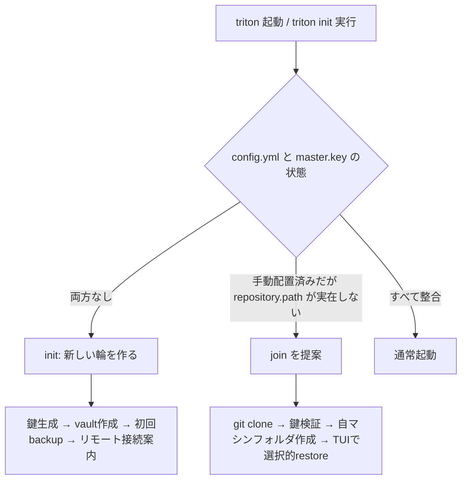
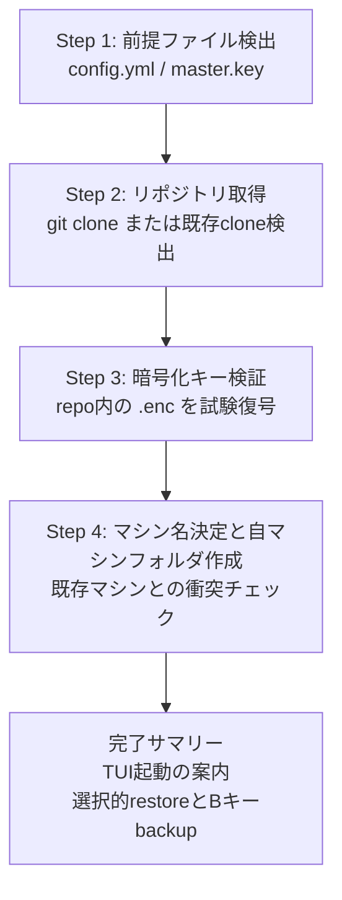

# Triton 導入フロー再設計: 「輪を作る」と「輪に入る」の分離

## 背景

Tritonの目的はバックアップだけでなく、**複数マシン間での設定ファイル共有**にある。
しかし現状のオンボーディングは「最初のマシンで新しくvaultを作る」シナリオに最適化されており、
**既存のvault（＝tritonの輪）に2台目以降のマシンとして参加する**シナリオの動線が弱い。

新しいMacをセットアップする典型的なユーザーの行動はこうなる:

1. パスワードマネージャーやUSB経由で `master.key` と `config.yml` を `~/.config/triton` に手動配置する（オフライン移行・これは設計通り）
2. `triton` を起動する
3. **ここで詰む**

ステップ2と3の間に必要な「リポジトリのclone」「自マシンフォルダの存在」といった前提条件を、
誰も教えてくれないし、検証もされない。開発者なら自力で埋められるが、一般ユーザーには酷である。

## 現状の問題点（コード根拠付き）

### P1: config.ymlのrepository.pathが実在しなくても誰も気づかない

- `_validate_config_for_tui()`（`cli.py:178-229`）はYAML構造と`repository.path`の**記法**は検証するが、
  **パスの実在・git cloneの有無は検証しない**
- `FileManager`も初期化時にパスを検証しない（`managers/file_manager.py:156-172`）
- 結果: 設定上は完璧でも、実体のないリポジトリを指したままTUIが起動する

### P2: 既存リポジトリをcloneする動線が存在しない

- initウィザードのVault Setup（`init_wizard.py:403-504`）の選択肢は
  「[1] 新規ローカルディレクトリ作成 / [2] 既存の**ローカル**Gitリポジトリを指定 / [3] スキップ / [4] GitHubガイド表示」のみ
- **リモートURLからのgit cloneという選択肢がない**。参加ユーザーは自分でcloneしてから[2]を選ぶ必要があるが、その案内はどこにもない
- CLIコマンド一覧にも`clone`/`join`に相当するものがない

### P3: リポジトリ不在でもTUIが起動してしまう

- auto_pullが有効な場合、起動画面で「Repository directory does not exist」とスキップ表示されるだけで
  TUIはそのまま立ち上がる（`tui_textual/screens/startup_screen.py:361-420`、`managers/git_manager.py:150-156`）
- ユーザーは空っぽの画面か、意味不明なエラーの断片を見ることになる

### P4: 自マシンフォルダ不在時、他マシンへ黙ってフォールバックする

- `get_available_machines()`はリポジトリ内の実在ディレクトリのみを列挙する（`tui_textual/adapters/file_adapter.py:58-96`）
- 自マシンのフォルダが無い場合、`_load_initial_data()`は**先頭のマシン（＝他人のマシン）を黙って選択**する
  （`tui_textual/screens/main_screen.py:90-127`）
- ユーザー視点: 「自分のMacの画面なのに、知らないマシンのファイル一覧が表示される」→ 意味がわからない
- マシンフォルダは初回backup時にしか作られない（`managers/file_manager.py:669`）ため、
  参加直後のユーザーは必ずこの状態に陥る

### P5: 参加ユーザーの目的は「restore」なのに、initは「backup」へ誘導する

- initウィザードのStep 6/6は「First Backup」であり、最後の推奨アクションも`triton backup`
- しかし輪に参加するユーザーの第一目的は**他マシンから設定を持ってくること（restore）**である
- さらに、何がバックアップされるか見えないまま初手でbackupを実行させるのは、
  TUIで内容を確認してから納得して`B`キーでバックアップしたいユーザー体験と逆行する

なお、ここでいうrestoreは**選択的な「つまみ食い」**である。tritonのrestoreは
全量復元ではなく、必要なファイルだけを段階的に持ってくる使い方が基本となる
（例: まず`.ssh/**`・`.zshrc`・`.zprofile`、brewセットアップ後に`.aws`・`.config/foo`…）。
全量復元はマシン固有の設定を踏み潰す事故につながるため、復元対象の選択は
一覧と差分が見える**TUIで行うのが正**であり、ウィザードが代行すべきではない。

### 問題の構造

すべての問題は一つの設計ギャップに帰着する:

> `triton init` は「**新しい輪を作る**」操作であり、「**既存の輪に入る**」操作が存在しない。

## 提案: コマンド体系の分離

| コマンド | 役割 | 想定ユーザー |
|---------|------|------------|
| `triton init` | 新しいvault（輪）を作る | 最初のマシン |
| `triton join` | 既存のvault（輪）に参加する | 2台目以降のマシン |
| `triton status` | セットアップ診断を含む状態確認 | 全員・AIエージェント |

### 役割分担の原則

- **init = create**: 鍵を生成し、vaultをgit initし、リモート接続を案内する。最終ゴールは「初回backupとpush」
- **join = clone + verify + 席の用意**: 既存の鍵と設定を受け入れ、vaultをgit cloneし、鍵を検証し、
  自マシンの席（フォルダ）を作る。最終ゴールは「TUIを起動すれば全マシンが見え、
  必要なファイルを選択的にrestoreできる状態」
- 両者は逆方向のデータフローを持つため、ウィザードの構成・完了時の推奨アクションも別物にする



### 相互誘導（ユーザーがコマンドを知らなくても辿り着ける）

ユーザーは`join`コマンドの存在を知らない前提で設計する。3つの入口すべてから誘導する:

1. **`triton init` の冒頭分岐**: ウィザード最初の質問を「新規作成か参加か」にする

   ```
   What would you like to do?

     [1] Create a new vault (this is my first machine)
     [2] Join an existing vault (I already use triton on another machine)

   Choice [1]:
   ```

   [2]を選んだらjoinウィザードへ移行する。

2. **`triton`（TUI起動）時の前提チェック**: repository.pathが実在しない場合、
   TUIを起動せずCLI側でガイダンスを表示する（P3対策、後述）

3. **`triton status`**: セットアップ診断チェックリストを表示し、欠けたステップと対応コマンドを示す

## `triton join` ウィザード設計

### 前提と入力状態

起点は「`master.key`と`config.yml`を`~/.config/triton`に手動配置済み」だが、
配置パターンの揺らぎをすべて受け入れる:

| 状態 | config.yml | master.key | joinの振る舞い |
|------|-----------|-----------|---------------|
| A（想定起点） | あり | あり | configからrepository.pathを読み、cloneを実行 |
| B | なし | あり | URL・パス・マシン名を質問し、最小configを生成してclone |
| C | あり | なし | clone後、鍵の配置を必須案内（鍵がないと.enc復号不可） |
| D | なし | なし | Bと同様 + 鍵の配置案内（initとの違いは「鍵を生成しない」こと） |

### ステップ構成



各ステップの設計意図:

- **Step 2（clone）**: configに`repository.path`があればそこへcloneする。
  URLはconfigに保存されていないため質問する（`git remote get-url`で既存cloneからの取得も試みる）。
  パスが既にcloneとして存在する場合は検証して再利用する（冪等性: joinは何度実行しても安全）。
  パスが空でないディレクトリかつgitリポジトリでない場合はエラーで停止する。
- **Step 3（鍵検証）**: joinならではの最重要ステップ。clone直後にリポジトリ内の`.enc`ファイルを1つ選び
  試験復号する。**鍵の取り違え（別の輪の鍵を置いた等）をrestore実行前に検出できる。**
  `.enc`ファイルが1つもないリポジトリでは検証スキップとして明示する。
- **Step 4（マシン名）**: 自動検出名がリポジトリ内の既存マシンフォルダと衝突する場合に必ず確認する。
  「同じマシンの再セットアップ（クリーンインストール）」なら既存フォルダを引き継ぎ、
  別マシンなら改名させる。黙って他マシンのフォルダに書き込む事故を防ぐ。
- **Step 4後半（自マシンフォルダ作成）**: P4の根本対策。ローカルに空フォルダを作成し、
  TUIのマシン一覧に自分が必ず現れるようにする。
  （注: Gitは空ディレクトリを追跡しないため、リモートへの反映は初回backup+pushまで発生しない。
  これは正しい挙動であり、ローカルTUI表示のためだけにフォルダを作る）
- **完了サマリー（TUIへの誘導）**: ウィザードはrestoreもbackupも**実行しない**。
  restoreは「つまみ食い」が基本であり、何をどの順で持ってくるかはユーザーの状況
  （brewのインストール状況等）に依存する。ファイル一覧と差分が見えるTUIで
  選択的にrestoreしてもらうのが安全であり、ウィザードの仕事は
  「TUIを起動すればすべて見える」状態を作ってそこへ送り出すことまでとする。
  backupも同様に、TUIで内容を確認して納得したら`B`キー、へ誘導する。

### ウィザード画面モック

CLI出力規則（`documents/development/CLI_DESIGN_GUIDE.md`）に準拠: 絵文字禁止、`✓✗!`記号、色+プレフィックス。

```
$ triton join

=======================================================
  Join an Existing Triton Vault
  Connect this machine to your dotfiles vault
=======================================================

This wizard will:
  1. Check your config and encryption key
  2. Clone your vault repository
  3. Verify your encryption key against the vault
  4. Register this machine

[Step 1/4] Checking prerequisites
  ✓ Config found: ~/.config/triton/config.yml
  ✓ Encryption key found: ~/.config/triton/master.key
  ✗ Vault not found: ~/dotfiles-vault (from config.yml)

[Step 2/4] Clone vault repository
  Your config expects the vault at: ~/dotfiles-vault

  Repository URL (e.g. git@github.com:you/dotfiles-vault.git):
  > git@github.com:asatamax/dotfiles-vault.git

  Cloning into ~/dotfiles-vault ...
  ✓ Cloned: 2 machines, 124 files

[Step 3/4] Verify encryption key
  Testing master.key against B4F/.ssh/id_ed25519.enc ...
  ✓ Key verified: encrypted files can be decrypted

[Step 4/4] Machine name
  Auto-detected: MacBook-Pro-2026

  Existing machines in vault:
    [0] B4F                (98 files, last backup 2026-06-08)
    [1] ProductionMachine  (26 files, last backup 2026-05-30)

  No conflict with existing machines.
  Use "MacBook-Pro-2026" for this machine? [Y/n]: y
  ✓ Registered: ~/dotfiles-vault/MacBook-Pro-2026/ (empty until first backup)

=======================================================
  Join Complete!
=======================================================

This machine:  MacBook-Pro-2026
Vault:         ~/dotfiles-vault (origin: github.com:asatamax/dotfiles-vault)
Encryption:    ✓ key verified
Machines:      B4F (98 files), ProductionMachine (26 files)

───────────────────────────────────────────────────────
Next step: launch the TUI

  triton

In the TUI you can:
  - Browse other machines and restore only the files
    you need (e.g. .ssh, .zshrc) -- selective restore
    is safer than restoring everything at once
  - Press B to create this machine's first backup
    once you are happy with your setup
───────────────────────────────────────────────────────
```

鍵検証が失敗するケース（取り違え検出）:

```
[Step 3/4] Verify encryption key
  Testing master.key against B4F/.ssh/id_ed25519.enc ...
  ✗ Decryption failed: this master.key does not match the vault

  Your master.key cannot decrypt files in this vault.
  Possible causes:
    - The key belongs to a different vault
    - The key file was corrupted during transfer

  Copy the correct key from another machine:
    scp other-machine:~/.config/triton/master.key ~/.config/triton/master.key

  Continue without encryption support? (encrypted files will be
  unreadable until the correct key is in place) [y/N]:
```

config.ymlが無い状態（状態B/D）での冒頭:

```
[Step 1/4] Checking prerequisites
  ✗ Config not found: ~/.config/triton/config.yml
  ✓ Encryption key found: ~/.config/triton/master.key

  No config found. A minimal config will be created.
  Tip: if your old machine backs up ~/.config/triton, you can
       restore the full config from the vault after joining.

  Vault location [~/dotfiles-vault]:
```

この最後のTipは重要で、`config.yml`自体がvaultにバックアップされている場合
（プリセットターゲットに`~/.config/triton`が含まれる）、join完了後のrestoreで
本来のconfigを取り戻せる。つまり「最小configでjoinし、restoreで完全なconfigに置き換える」
というブートストラップが成立する。

## TUI起動時の振る舞い変更

### 起動前チェック（TUIを開く前にCLI側で弾く）

`_validate_config_for_tui()`を拡張し、repository.pathの実在とgitリポジトリ判定を追加する。
不合格ならTextualを起動せず、CLI標準出力でガイダンスを表示する:

```
$ triton
Error: Vault not found: ~/dotfiles-vault

Your config points to a vault that does not exist on this machine.

  If you already use triton on another machine:
    triton join            # clone your vault and register this machine

  If this is your first triton setup:
    triton init            # create a new vault
```

TUIの中で複雑なセットアップ誘導を実装するより、起動前にCLIで弾くほうが
責務分離（TUIはブラウジング、CLIがセットアップ）にも合致し、実装も単純になる。

### 自マシンフォルダ不在時のフォールバック廃止

P4の対策。`_load_initial_data()`の挙動を以下に変更する:

1. リポジトリは存在するが自マシンフォルダが無い場合、**空フォルダを自動作成**する
2. マシン選択は**必ず自マシン**を初期選択とする（他マシンへの黙ったフォールバックを廃止）
3. 自マシンが空の場合、ファイルペインに空状態メッセージを表示する:

```
┌─ MacBook-Pro-2026 (this machine) ──────────────────┐
│                                                     │
│   No backups yet for this machine.                  │
│                                                     │
│   B          Create your first backup               │
│   ← / →      Browse other machines to restore from  │
│                                                     │
└─────────────────────────────────────────────────────┘
```

これにより:

- ユーザーは「自分のマシンにはまだ何もない」ことを正しく理解できる
- バックアップを強制されず、他マシンの中身を見て納得してから`B`でバックアップできる
- 「知らないマシンのファイルが表示される」混乱が消える

## `triton status` のセットアップ診断

joinの存在を知らないユーザー・AIエージェント双方のための診断入口。
既存の`triton status`にチェックリストを追加する:

```
$ triton status
Setup:
  ✓ Config:      ~/.config/triton/config.yml
  ✓ Master key:  ~/.config/triton/master.key (verified against vault)
  ✗ Vault:       ~/dotfiles-vault (not found)
  ! This machine: no folder in vault yet

  → Run 'triton join' to clone your vault and register this machine.
```

すべて正常な場合は従来のstatus出力に1行のサマリーを足すのみとする。
`--json`対応により、AIエージェントが「次に何をすべきか」を機械判定できるようにする
（`triton config --schema`のワークフロー定義にもjoinを追加する）。

## initウィザードへの影響

- 冒頭に「Create / Join」分岐を追加する（前述）
- Vault Setupの選択肢に「Clone from remote URL」を追加してもよいが、
  それはjoinの領分なので、**選ばれたらjoinフローへ委譲する**（ロジックの重複実装はしない）
- 鍵ステップの「[2] Use existing master.key」が選ばれた場合も、
  実態はjoinシナリオであることが多いため、joinへの誘導メッセージを添える

## 実装影響範囲

| 変更 | 対象 | 種別 |
|------|------|------|
| `join`コマンド + JoinWizard | `cli.py`, `join_wizard.py`（新規） | 追加 |
| init冒頭のCreate/Join分岐 | `init_wizard.py` | 変更 |
| 鍵の試験復号（verify） | `encryption/`に検証API追加、wizard/statusから利用 | 追加 |
| TUI起動前のvault実在チェック | `cli.py` `_validate_config_for_tui()` | 変更 |
| 自マシンフォルダ自動作成 + フォールバック廃止 | `tui_textual/screens/main_screen.py`, `adapters/file_adapter.py` | 変更 |
| 空状態メッセージ | `tui_textual/widgets/`（ファイルペイン） | 追加 |
| statusのセットアップ診断 | `cli.py` status, `validation_display.py` | 変更 |
| `--schema`へのjoin追加 | `schema.py` | 変更 |

設計上の注意:

- ウィザードはCLI層の責務とし、clone/鍵検証/フォルダ作成の実体は
  `git_manager.py` / `encryption/` / `file_manager.py` に置く（ビジネスロジックをCLIに持たせない）
- InitWizardとJoinWizardで共通するステップ（マシン名決定、パス入力検証など）は
  基底クラスまたは共通モジュールに抽出してDRYを保つ
- joinは**冪等**に設計する: 途中で失敗しても再実行すれば完了済みステップを検出してスキップする

## 段階的導入プラン

1. **Phase 1（事故防止・最小）**: TUI起動前のvault実在チェック + 自マシンフォルダ自動作成と
   フォールバック廃止。joinコマンドが無くても、P3/P4の「意味がわからない」体験はこれだけで消える
2. **Phase 2（動線整備）**: `triton join`ウィザード本体 + 鍵検証API + statusのセットアップ診断
3. **Phase 3（統合）**: init冒頭のCreate/Join分岐 + `--schema`ワークフロー更新 + ドキュメント
   （CONFIGURATION.md / TUI.md / README）への反映
