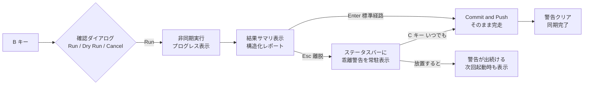
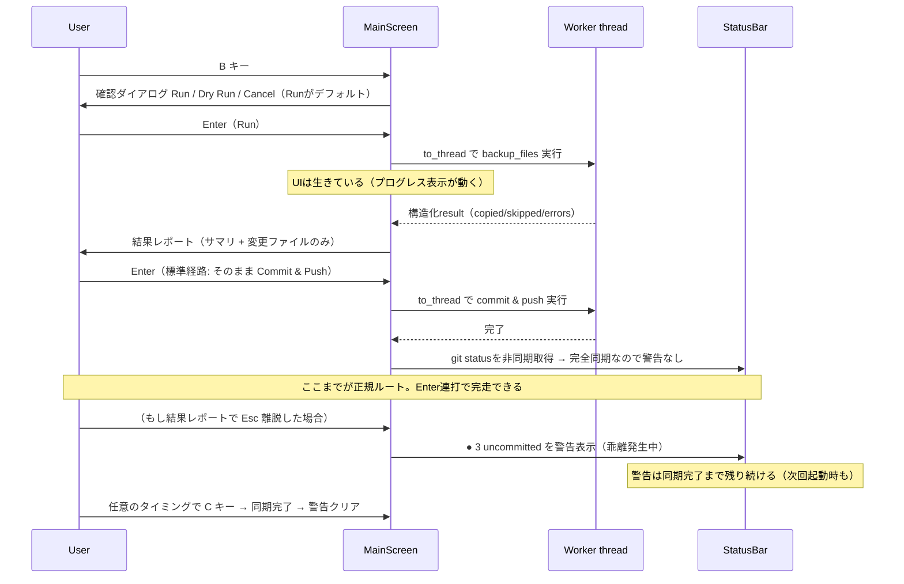

# Triton TUI 改善分析・リファインメント計画

TUI（`triton_dotfiles/tui_textual/`）全コード（約6,400行）を精査した結果をまとめる。
「確定バグ」「UX/DXの問題」「アーキテクチャの問題」に分類し、最後に実装ロードマップ（P0〜P2）を示す。

---

## 1. 総評

TUIは機能的には豊富（5タブビュー、フィルタ、グルーピング、select mode、startup screen等）だが、
**「操作結果の伝え方」と「状態の可視化」が弱く**、それが "2流感" の正体になっている。

具体的には:

1. **結果ダイアログが「CLI出力のダンプ」**になっている（stdoutキャプチャ + ANSIコード + 構造化リストの二重表示）
2. **重要な状態（未コミット・未push・未pullという「乖離」）が画面のどこにも常駐していない**ため、
   commitへの誘導が成功ダイアログの一瞬にしか存在せず、そこで閉じると乖離状態が不可視のまま残る
3. **長時間操作がイベントループをブロック**しており、プログレスダイアログが固まる
4. 右ペインのコンテンツが**縦・横ともに切られる**レンダリングバグがある

これらは独立した不具合ではなく「**操作 → 結果 → 次のアクション**」という情報設計の不在に根がある。
P1の「Backup体験の再設計」で一括して解消する。

### 1.1 このツールにおける「安全」の定義（本ドキュメントの大前提）

Tritonは**gitを介した複数マシン同期ツール**であり、一般的なgitツールの
「push = 重い・危険な操作」という常識は当てはまらない。リスクは2軸で整理する。

| 軸 | 危険な状態 | 該当操作 | UIの方針 |
|----|-----------|---------|---------|
| **A: ローカル破壊** | ローカルファイルの上書き・repoからの削除 | Restore, Cleanup | 確認必須・安全側デフォルト・対象一覧の明示 |
| **B: 同期乖離（drift）** | pullせず起動 / backup後にcommitしない / commitしてpushしない | （操作ではなく**不作為**） | backup→commit→pushを**一続きで完走させる**のが正。摩擦は最小限に。途中離脱したら乖離を警告し続ける |

軸Bが重要な理由: dirtyなrepoは起動時auto-pullをスキップさせ（`startup_screen.py:383-396`）、
未pushのcommitは他マシンとの衝突の種になる。**「commitしないこと」こそが深刻なgit上の
混乱に繋がる**。したがって commit & push は「慎重に扱う操作」ではなく
「同期を完了させるための標準動作」として設計する（同期ファースト原則）。

---

## 2. 確定バグ一覧

### BUG-1: 存在しないアクションへのキーバインド（←/→キーが死んでいる）

`app.py:127-131`

```python
Binding("left", "focus_left", "Focus Left"),
Binding("right", "focus_right", "Focus Right"),
Binding("enter", "select_file", "Select"),
```

`action_focus_left` / `action_focus_right` / `action_select_file` は**コードベースのどこにも定義されていない**（grep済）。
←→キーは何も起こさず、Footerには "Focus Left / Focus Right / Select" と嘘の表示が出る。
Enterはたまたま `ListView` 側のハンドリングで動いているように見えるだけ。

**修正方針**: アクションを実装する（左右ペインのフォーカス移動は実際に有用）か、バインドを削除する。

### BUG-2: 右ペインのコンテンツが縦に切られる（ユーザー報告の根本原因）

`content_viewer.py:452, 474, 494, 882`

```python
content_widget.styles.height = line_count + 2  # 少し余裕を持たせる
```

Staticの高さを**論理行数**で固定しているが、シンタックスハイライトに失敗してプレーン `Text`
フォールバックになった場合、長い行は折り返されて**レンダリング行数 > 論理行数**になる。
その結果、末尾が表示されずに切れる。

さらに `content_viewer.py:131-136` のCSSで `min-height: 100vh` という相反するハックも入っており、
高さ制御が三つ巴（CSS auto / min-height 100vh / inline height）で衝突している。

**修正方針**: inline heightハックと `min-height: 100vh` を全廃し、`height: auto` に統一。
切り詰めはレイアウトではなくコンテンツ側（プレビュー行数制限）でのみ行う。

### BUG-3: 右ペインの長い行が横に切られ、横スクロールもできない

- `Syntax`（rich）はデフォルトで折り返さず、コンテナ幅で**クロップ**される
- `ScrollableContainer` に `overflow-x` 指定がなく、`Static` が `width: 1fr` のため
  横スクロールバーも出ない

**修正方針**: `w` キーで word-wrap トグル（デフォルトON推奨）+ wrap OFF時は
`width: auto` + `overflow-x: scroll` で横スクロール可能にする。

### BUG-4: Diffが50行で打ち切られ、続きを見る手段がない

`constants.py:11` `MAX_DIFF_LINES = 50`

dotfilesの差分で50行は普通に超える。"... and N more lines" と出るだけで続きは見られない
（VSCode diffに逃げるしかない）。

**修正方針**: 制限を `MAX_PREVIEW_LINES`（1000）と同等まで引き上げる。
描画コストが問題になるのは数千行クラスなので、50は過剰防衛。

### BUG-5: 長時間操作がUIをフリーズさせる（偽プログレスダイアログ）

`main_screen.py` の `_perform_backup` / `_perform_restore` / `_perform_export` /
`_perform_git_pull` / `_perform_git_commit_push` はすべて:

```python
result = self.file_adapter.backup_files_to_repository(dry_run=dry_run)  # 同期ブロッキング
```

`run_worker` でコルーチンとして起動していても、**中身が同期呼び出しなのでイベントループごと止まる**。
ProgressDialogは表示された瞬間に固まり、ProgressBarも一切更新されない
（`update_progress` は全コードで未使用）。

対照的に `startup_screen.py:300,371,399` は `asyncio.to_thread` を正しく使っている。

**修正方針**: アダプタ呼び出しをすべて `await asyncio.to_thread(...)` に統一。
ただし BUG-9（stdoutキャプチャ）を先に解消しないとスレッド競合の地雷になる。

### BUG-6: VSCode検出で最大20秒のフリーズ + 毎回再検出

`file_adapter.py:1126-1141`（`open_vscode_edit` 側にも完全な重複コードあり）

`code` / `code-insiders` / `cursor` / `windsurf` を順に `--version` 実行（timeout 5秒）して検出。
`code --version` はNode起動を伴い1秒前後かかる。**D/Eキーを押すたびに**メインスレッドで実行される。

**修正方針**: `shutil.which()` による存在チェックに置き換え（`--version` 実行は不要）、
結果をアダプタにキャッシュ。設定 `tui.editor` で明示指定も可能にする。

### BUG-7: VSCode diff用の復号済み一時ファイルが削除されない（セキュリティ）

`file_adapter.py:1202-1203`

```python
# 注意: 一時ファイルはVSCodeが開いている間は削除しない
# TODO: より良いクリーンアップ機構が必要
```

暗号化ファイル（SSH鍵等）を**復号して** `/tmp/triton_diff_*` に書き出し、**永久に残る**。
mkdtempなので0700ではあるが、「暗号化は必須」というプロジェクトの安全方針と矛盾する。

**修正方針**:
- 一時ファイルのパーミッションを `0600` で明示
- TUI終了時（`App.on_unmount`）に自分が作った `triton_diff_*` を全削除
- 起動時に前回の残骸も掃除（プロセスIDやマーカーファイルで自分のものと判別）

### BUG-8: ダイアログ間でEnterの意味論が不統一（予測可能性の問題）

`dialogs.py:762-763`

```python
# Commit & Pushボタンにフォーカス（Enterで即実行可能に）
self.query_one("#commit-button", Button).focus()
```

**Enter = そのままcommit & pushへ進む、というデフォルト自体は正しい**（§1.1の
同期ファースト原則。backup→commit→pushは一続きで完走させるべき標準経路であり、
`_handle_commit_continuation_choice` が確認を挟まず直接実行するのも妥当）。

問題は予測可能性: `MessageDialog` / `ScrollableMessageDialog` では **Enter = 閉じる** で、
このダイアログだけ **Enter = 次の操作へ進む**。同じ見た目の「結果ダイアログ」で
Enterの意味が変わることに、UIから事前に気づけない。

**修正方針**: 高速経路は維持したまま、意味論の違いを視覚化する。
- 「情報を見て閉じるだけのダイアログ」と「次のアクションに進むダイアログ」の見た目を明確に
  差別化する（ボーダー色・フォーカス中ボタンの強調表示・`Enter → Commit & Push` の明示など）
- Escでの離脱は常に安全（何もしない）に統一
- 離脱した場合の乖離状態は§3.1(b)の常駐インジケータが警告し続ける

### BUG-9: stdoutの差し替えによるCLI出力キャプチャ

`file_adapter.py:830-843`

```python
sys.stdout = captured_output
result = self.file_manager.backup_files(machine_name, dry_run=dry_run)
sys.stdout = original_stdout
```

- プロセスグローバルな差し替えでスレッド非安全（BUG-5の修正と正面衝突する）
- TUI動作中に他のコードがprintしたものまで巻き込む
- そもそも「CLI向け人間可読出力をTUIに流用する」のが情報散逸の原因（§3.1）

**修正方針**: `FileManager.backup_files` はすでに構造化された `result` dict
（copied/skipped/errors/cleaned）を返している。**キャプチャしたconsole出力は捨て**、
構造化データからTUI専用の表示を組み立てる。

### BUG-10: Diffの方向が直感と逆

`file_adapter.py:492-500`

```python
difflib.unified_diff(local_lines, backup_lines, fromfile="local/...", tofile="backup/...")
```

local→backupの方向なので、**ローカルで追記した行が赤（-）で表示される**。
Infoタブの "AHEAD"（ローカルが新しい）の意味論とも矛盾。
dotfiles管理の通常メンタルモデルは「backupを基準に、ローカルで何が変わったか」。

**修正方針**: `unified_diff(backup_lines, local_lines, fromfile="backup/...", tofile="local/...")`
に反転。ローカルの追記が緑（+）になる。

### BUG-11: 部分成功が「Failed」表示になる

`file_adapter.py:912` `"success": error_count == 0`

62ファイル中61成功・1エラーでも `Backup Failed` ダイアログ（赤✗）になる。
コピーされた61ファイルの事実が「失敗」の見た目に埋もれる。

**修正方針**: success / partial / failed の3状態にする。

### BUG-12: マシン選択ダイアログのファイル数がデタラメ

`file_adapter.py:71-78` がトップレベルの**直下ファイルのみ** `os.listdir` でカウントしているが、
実際のファイル一覧は `os.walk` で再帰収集している。ネストがあるマシンでは数字が大きくズレる。
さらに `machines.sort(key=file_count, reverse=True)`（`file_adapter.py:91`）のため、
**マシンの並び順がバックアップのたびに変わる**。

**修正方針**: `os.walk` で正しくカウント（または一覧取得処理と共通化）。並びは名前順固定 +
現在のマシンを先頭に。

### BUG-13: Welcomeメッセージのキー表記が誤り

`main_screen.py:169-180`

```
• File restore (r)   ← 実際は R（大文字）
• File export (e)    ← 実際は x
```

### BUG-14: smart_shorten_path の幅計算ミス

`file_list.py:37-39` 等。省略記号に `…`（1文字）を使うのに `max_width - 3`（"..."想定）で
計算しており、毎回2文字分の表示幅を無駄にしている。

### BUG-15: StatusBarの右寄せがセル幅非対応

`status_bar.py:80-83` が `len()` でパディング計算しているため、CJK文字を含むパスで
右寄せがズレる。Rich の `cell_len`（`rich.cells.cell_len`）を使うべき。

### BUG-16: 例外の握りつぶしによるサイレント故障

`app.py:197-198` （`on_startup_complete` 全体を `except Exception: pass`）が最悪のケースで、
ここで失敗すると**真っ白な画面のまま何も起きない**。
コードベース全体で `except Exception: pass` が30箇所以上あり、本物のバグを隠蔽している。

**修正方針**: 少なくとも `self.log.error()` への記録と、ユーザー影響がある箇所は
`notify(severity="error")` を必須にする。

### BUG-17: デッドコード

- `FileList.select_all` / `deselect_all`（`file_list.py:672-681`）— どこからも呼ばれず、
  キーバインドも未配線。便利機能なのにユーザーから見えない
- `ContentViewer.add_future_tab`（`content_viewer.py:1118`）— 中身のない予約メソッド
- `DialogResult`（`dialogs.py:22-28`）— 未使用Message

---

## 3. UX/DXの問題と改善提案

### 3.1 Backup体験の再設計（ユーザー指摘の本丸）

#### 現状の問題

1. **情報の散逸・二重表示**: 結果ダイアログの中身が
   「キャプチャしたCLI出力（ANSI色付き、ファイルリスト含む）」+「アダプタが再構築した
   ファイルリスト（同じ内容）」+「Next steps（CLIコマンド例）」の継ぎ接ぎ。
   同じファイルが2回出てくる上、肝心のサマリ（何件コピーされたか）がタイトル下の1行だけ。
2. **離脱時に乖離が不可視になる**: backup→commit&pushへ続くダイアログ連鎖自体は
   同期ファースト原則（§1.1）に合致した正しい流れ。問題は、ここでCloseすると
   **「repoに未コミットの変更が残っている」という乖離状態を思い出す手段がゼロ**なこと。
   乖離はauto-pullのスキップやマシン間衝突に直結するのに、画面は何も警告しない。
3. **TUI内のNext stepsに `git add ...` などの生CLIコマンドが表示される**
   （TUIなら `C` キーを案内すべき）。

#### 提案: 「完走を標準経路に、離脱したら乖離を警告し続ける」



具体策:

- **(a) 結果レポートの構造化**: stdoutダンプをやめ、構造化データから描画する。

  ```
  ✓ Backup complete                    MacBook-Pro → repo
  ──────────────────────────────────────────────
   Copied   3     Skipped  59     Errors  0
  ──────────────────────────────────────────────
   M  .zshrc
   M  .config/triton/config.yml
   +  .config/newtool/config.toml
  ──────────────────────────────────────────────
   Repository has uncommitted changes.
   [Enter] Commit & Push    [Esc] Close

  ```

  変更があったファイルだけをGit風プレフィックス（`M`/`+`、色付き）で出す。
  Skipped 59件のリストはデフォルト折りたたみ（キーで展開）。

- **(b) 乖離（drift）の常駐警告インジケータ**:
  ステータスバー右端（またはヘッダー）に Git 状態を常駐表示する。

  ```
  ~/.zshrc                              ● 3 uncommitted │ ↑1 unpushed
  ```

  - backup / cleanup / commit / 起動時に `git status --porcelain` + ahead/behind を
    非同期で取得して更新
  - 未コミット `● N uncommitted`（黄）、未push `↑N unpushed`（黄）、
    リモート先行 `↓N behind`（赤、pullが必要）。**完全同期時のみ表示なし（または ✓ sync）**
  - これは「便利情報」ではなく**警告**である（§1.1: 乖離こそが危険）。
    成功ダイアログから離脱しても、起動時auto-pullがdirtyでスキップされても、
    画面が乖離を訴え続けるので、`C` 一発でいつでも同期を完了できる
- **(c) Enter = Commit & Push の高速経路は維持**（BUG-8参照）。
  視覚的にフォーカスを明示した上で、Enter連打で backup→commit→push が
  完走できる流れを「正規ルート」として磨く。Escでの離脱は常に安全（何も実行しない）

### 3.2 確認ダイアログ体系の整理

§1.1の2軸（A: ローカル破壊 / B: 同期乖離）で摩擦の強さを決める。

| 操作 | リスク軸 | 現状 | あるべき姿 |
|------|---------|------|-----------|
| Backup（repo側に書く・gitで戻せる） | なし（同期の入口） | 3択確認 | 確認は軽く。実行しない方が乖離リスク |
| Git Pull（fast-forward想定） | なし（同期の維持） | Yes/No確認 | 起動時auto-pullは無確認なのに手動Pだけ確認するのは不整合。確認なしで実行→結果通知でよい |
| Restore（ローカル上書き・archiveあり） | **A: ローカル破壊** | Yes/No確認 | 維持。**対象ファイル一覧をダイアログに表示**（今は件数のみ） |
| Commit & Push（同期の完了） | なし（むしろ**やらないことが軸Bのリスク**） | 単体実行時は3択 / backup後は確認なし | 摩擦最小で正しい。backup後の無確認連続実行は意図通りの設計として維持。単体Cの3択はcommit対象の事前確認として有用なので残す |
| Cleanup（repoから削除） | **A: repo側の削除**（gitで戻せるが慎重に） | 3択確認 | 維持。dry-run結果からそのまま本実行に進めるボタンを追加（今はdry-run後にもう一度やり直し） |

デフォルトフォーカスの原則: **軸A（Restore上書き・Cleanup削除）のみNo/Cancelをデフォルト**にする。
Backup / Pull / Commit & Push は同期を前進させる操作なので、Yes（実行）デフォルトで
Enter連打で完走できることがむしろ望ましい。

### 3.3 右ペインの品質（BUG-2/3/4とセットで）

- word-wrapトグル（`w`）、wrap状態をタブ横かボーダータイトルに表示
- 行数制限で切ったときは「`v`（select mode）で全文・`E`で外部エディタ」への導線を末尾に表示
- Splitビュー: 左右の**スクロール同期**（オプション）がないと差分比較ツールとして実用にならない。
  少なくとも将来課題として明記
- Infoタブは情報設計が良いので、ここを「ファイルのダッシュボード」として育てる
  （diff統計、最終backup日時、所属target、適用された暗号化パターン等）

### 3.4 Footerの過密

`show=True` のバインドが約20個あり、普通の端末幅では後半が見切れる。

**提案**: Footer表示は7個程度に厳選（`B Backup` `R Restore` `d Diff` `m Machine`
`C Commit` `/ Filter` `? Help`）。残りは `show=False` にして `?` ヘルプに集約。
Textualの `Footer` は priority バインドだけ表示する機能があるので活用する。

### 3.5 ファイルリストのDX

- **select_all の配線**（BUG-17）: `a` = 表示中を全選択 / `A` = 全解除
- 確認ダイアログに対象ファイルリストを表示（多い場合は先頭N件 + "and N more"）
- **操作後にカーソル位置がリセットされる**: backup/restore後の `load_files` で
  ListViewが再構築され先頭に戻る。`preserved_machine_id` と同様にハイライト中の
  ファイル名も保存・復元する
- 絵文字アイコン（📄🔐💾🌟🆕）はプロジェクト自身のCLI設計規則
  「絵文字禁止（幅が不安定）・Unicode記号OK」と矛盾。`🔐 → ◆` / `📄 → 無印` /
  `🌟 → ★` 等のセル幅1の記号に置換し、フォント環境による崩れを根絶する
- パフォーマンス: 行ごとに `Checkbox` ウィジェット（Horizontal + Checkbox + Label）を
  生成しており、数百ファイルで描画が重い。`Text` ベースの `[x]` マーカーに置換すると
  ウィジェット数が1/3になる。`_update_list_view` の `self.files.index(file_info)` も
  O(n²)（インデックスを事前に持たせれば解消）

### 3.6 Exportフロー

- 素の `Input` にディレクトリパスを手打ちさせるのは2005年感が強い。最低限:
  - デフォルト値を `~/Desktop/triton-export`（絶対パス表示）にする
  - 入力中にパスの存在チェック結果をライブ表示（存在する=緑 / 作成される=黄）
  - 将来的には `DirectoryTree` ベースのピッカー

### 3.7 その他

- ヘルプダイアログのキー一覧と実際のバインドの**自動同期**（BINDINGSから生成）。
  手書きの二重管理が既にWelcomeテキストでズレている（BUG-13）
- 起動直後（StartupScreen中）の操作不能時間。hooksが長い場合、`Esc` でスキップして
  先にメイン画面へ進めるとよい
- Pull Required時の「pullしたらもう一度自分でcommit & pushしてね」は、
  pull成功後にそのままcommit & pushを再試行する選択肢を出せば1ステップで済む

---

## 4. アーキテクチャ/コード品質の問題

### 4.1 アダプタの肥大化と責務逸脱（AGENTS.md違反）

`file_adapter.py`（1,362行）が以下を**自前実装**している:

- ファイルスキャン・diff計算（`get_file_diff`）→ `FileComparisonManager` と重複実装
- VSCode起動ロジック（`open_vscode_diff` / `open_vscode_edit` でコマンド検出コードが丸ごと重複）
- CLI出力のキャプチャ・整形（BUG-9）

AGENTS.mdの「TUIはアダプター経由でCLI機能を呼び出す（ロジックを持たない）」に反する。

**提案**: アダプタは「manager呼び出し + TUI向けDTO変換」のみに縮小。
diff取得は `FileComparisonManager` に寄せ、エディタ起動は `managers/` 配下の
`editor_manager.py`（CLI からも使える）に切り出す。

### 4.2 ダイアログのDRY違反

7つのダイアログクラスが `DEFAULT_CSS`（dialog-container / dialog-buttons …）、
`on_key`、`color_map` / `icons` dict をそれぞれコピペ保持している。

**提案**: `BaseDialog(ModalScreen)` を1つ作り、共通CSS・アイコン/色マップ・
キーハンドリング（Esc=安全側で閉じる）を集約。各ダイアログは compose の中身だけ持つ。
`_show_backup` / `_show_encrypted_backup` / `_show_local_only_backup` の3兄弟も
ほぼ同一なので1メソッドに統合。`set_view_mode` / `_delayed_set_view_mode` も重複。

### 4.3 依存バージョン

`pyproject.toml` の `textual>=0.40` に対し実環境は 5.0.1。textualは破壊的変更が多い
ライブラリなので `textual>=5.0,<6` 程度に絞るべき（0.40時代のAPIとは別物）。

### 4.4 TUIテストの不在

TUIのテストは実質ゼロ（`smart_shorten_path` の単体テストのみ）。
Textualの **Pilot**（`App.run_test()`）はheadlessで動くため、
「TUI実行禁止（端末破壊防止）」ルールと両立してCIで回せる。

**提案**（優先順）:
1. ダイアログのキーハンドリング（Enterがcommitを暴発させない、のリグレッション防止）
2. backup→結果表示→ステータスバー更新のフロー
3. FileListのフィルタ/選択ロジック

---

## 5. 実装ロードマップ

### P0 — バグ修正（即やる・小さく安全）

| # | 内容 | 対象 |
|---|------|------|
| P0-1 | 死んだバインド削除 or 実装（←/→/Enter） | BUG-1 |
| P0-2 | 右ペインの高さハック撤廃 + wrapトグル + 横スクロール | BUG-2, BUG-3 |
| P0-3 | MAX_DIFF_LINES を 1000 に | BUG-4 |
| P0-4 | 全長時間操作を `asyncio.to_thread` 化（stdoutキャプチャ廃止が前提） | BUG-5, BUG-9 |
| P0-5 | 結果ダイアログ2種（閉じるだけ/次へ進む）の視覚的差別化とEnter挙動の明示 | BUG-8 |
| P0-6 | VSCode検出を `shutil.which` + キャッシュに | BUG-6 |
| P0-7 | 復号済み一時ファイルのクリーンアップ | BUG-7 |
| P0-8 | diff方向の反転 | BUG-10 |
| P0-9 | Welcomeテキスト等の表記修正 | BUG-13 |

### P1 — UX再設計（このプロジェクトの「一流化」の本体）

| # | 内容 |
|---|------|
| P1-1 | Backup/Cleanup結果レポートの構造化表示（§3.1a） |
| P1-2 | 乖離警告インジケータの常駐（§3.1b）— uncommitted/unpushed/behind の可視化。「離脱したら乖離が見えなくなる問題」の根治 |
| P1-3 | 確認ダイアログ体系の統一（§3.2）+ BaseDialog化（§4.2） |
| P1-4 | Footer厳選 + ヘルプ自動生成（§3.4） |
| P1-5 | select_all配線・カーソル位置保持・確認時のファイルリスト表示（§3.5） |
| P1-6 | 絵文字→セル幅安定記号への置換（§3.5） |
| P1-7 | 部分成功の3状態表示（BUG-11）、マシン一覧の件数/並び修正（BUG-12） |

### P2 — 品質・基盤

| # | 内容 |
|---|------|
| P2-1 | アダプタ縮小・diffロジックのmanager集約・editor_manager切り出し（§4.1） |
| P2-2 | FileListのパフォーマンス改善（Checkboxウィジェット廃止、O(n²)解消） |
| P2-3 | Pilotベースのヘッドレステスト導入（§4.4） |
| P2-4 | 例外握りつぶしの全面見直し（BUG-16）、textualバージョンピン（§4.3） |
| P2-5 | Exportのパス入力UX改善（§3.6）、Splitスクロール同期 |

### 推奨実装順

P0は相互依存が少なく1コミットずつ安全に進められる（P0-4のみP0-9=stdout廃止と同時に行う）。
P1はP1-3（BaseDialog）→ P1-1/P1-2（Backup体験）の順が手戻りが少ない。
P1-2のGit状態取得は `git_manager` に `get_status_summary()` を足すだけで済み、
CLI側（`triton status`）からも再利用できる。

---

## 6. 設計メモ: 新しいBackupフローの画面遷移



ポイント: **backup→commit→pushの完走を最短の正規ルートとして磨く**（同期ファースト、§1.1）。
離脱は自由だが、乖離状態が常に画面に見えているので「キャンセルしたらどうなる？」という
不安も、commit忘れによるgit上の混乱も発生しない。
